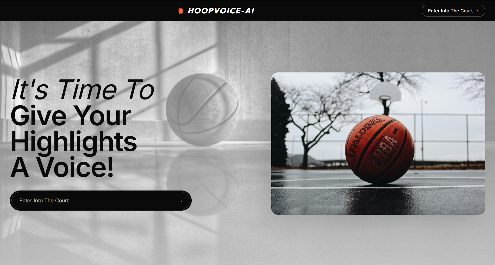
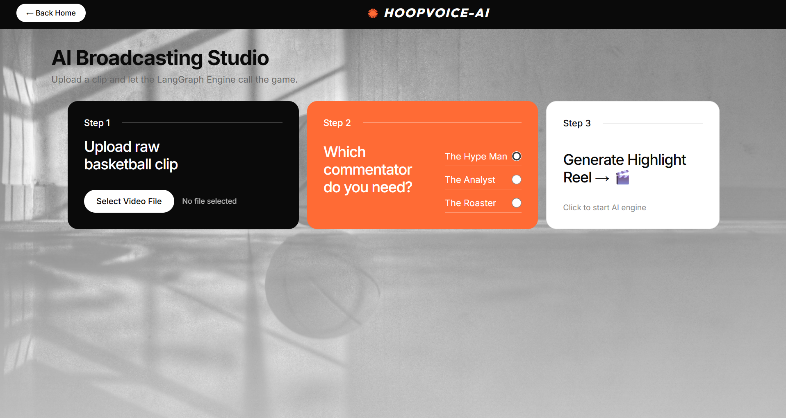

# 🏀 HoopVoice AI: The Voice of the Local Court




### HoopVoice AI is an end-to-end, stateful multi-agent system that autonomously generates professional-grade, personality-driven commentary for amateur basketball footage. By bridging the gap between raw video and professional broadcasting, we turn every local game into a "Sportscenter" highlight reel.

## Team: AND1  
- **Member**: Aviral Mishra
- **Category**: The Fan Experience / Open Innovation

##  The Vision
In a world where 99% of sports are played in silence, HoopVoice AI democratizes the professional broadcast experience. Whether it's a high school tournament or a pickup game at the park, our system uses Multimodal Agentic AI to understand the narrative, track the momentum, and speak the language of the game.

### 🎥 Live Demo Output
- **[Download / View Original Raw Video](https://github.com/AviralMishra039/AND1/raw/main/assets/original_video.mp4)**
- **[Download / View HoopVoice AI Output](https://github.com/AviralMishra039/AND1/raw/main/assets/output_hoopvoice.mp4)**

##  Tech Stack
- **Vision Engine**: Gemini 2.5 Flash (Multimodal event extraction & synchronized timestamping)
- **Orchestration**: LangGraph (Stateful Agentic workflow)
- **Brain**: Gemini 2.5 Flash (Scripting, narrative reasoning, & strict duration constraints)
- **Voice Synthesis**: ElevenLabs (Emotive TTS with Python SDK & pyttsx3 offline fallback)
- **AV Processing**: MoviePy & Pydub (Audio ducking, timeline alignment, and sync)
- **UI/UX**: Streamlit (Interactive dashboard)


##  Agentic Architecture
Unlike simple "video-to-text" tools, HoopVoice uses a Stateful Pipeline:

1. **The Scout (Perception)**: Analyzes the video stream to extract structured JSON logs of plays, player descriptions, and intensity levels. Interleaves precise physical timestamps alongside video frames for perfect LLM temporal awareness.
2. **The Analyst (Memory)**: Uses LangGraph to maintain a "Game State." It tracks scoring streaks, "clutch" moments, and player performance over time to build a rolling narrative context.
3. **The Hype-Writer (Narrative)**: Converts raw data into personality-driven SSML scripts. Supports dynamically bounded mathematical dialogue length limits to prevent audio clipping. Supports multiple personas: The Analyst, The Hype-Man, and The Roaster.
4. **The Director (Production)**: Generates the audio tracks and automatically "ducks" (lowers by -18dB) the original game volume to ensure the drafted commentary perfectly overlays the original audio timeline.

##  Project Structure
```text
hoopvoice-ai/
├── agents/           # Scout, Analyst, and Writer logic
├── engine/           # ElevenLabs TTS & MoviePy / Pydub processing
├── state/            # LangGraph workflow & Game State models
├── utils/            # Pydantic validation schemas
├── app.py            # Streamlit Dashboard entry point
└── requirements.txt  # Project dependencies
```

##  How to Run
1. Install dependencies via `requirements.txt` or `uv`.
2. Configure your API keys in a `.env` file (`GEMINI_API_KEY` and `ELEVENLABS_API_KEY`).
3. Ensure **FFmpeg** is installed and accessible in your system PATH.
4. Run the Streamlit orchestrator: `streamlit run hoopvoice-ai/app.py`
5. Upload an `.mp4` basketball clip and select your desired announcer persona!

## Note
I have not yet deployed the app, but I will soon!