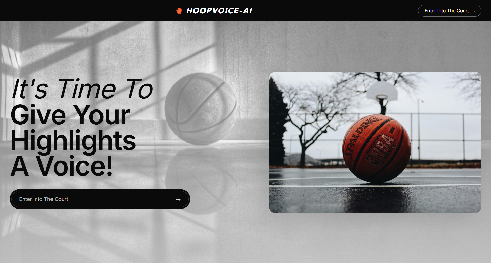
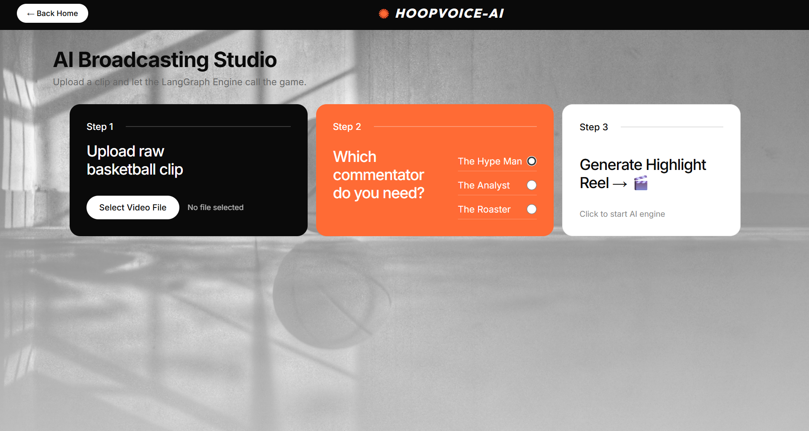

# 🏀 HoopVoice AI: The Voice of the Local Court




### HoopVoice AI is an end-to-end, stateful multi-agent system that autonomously generates professional-grade, **two-voice commentary booth** audio for amateur basketball footage. By bridging the gap between raw video and professional broadcasting, we turn every local game into a "Sportscenter" highlight reel — with a hype-man play-by-play voice and your pick of an Analyst or Roaster color commentator riffing off each other.

## Team: AND1  
- **Member**: Aviral Mishra
- **Category**: The Fan Experience / Open Innovation

##  The Vision
In a world where 99% of sports are played in silence, HoopVoice AI democratizes the professional broadcast experience. Whether it's a high school tournament or a pickup game at the park, our system uses Multimodal Agentic AI to understand the narrative, track the momentum, and speak the language of the game.

### 🎥 Live Demo Output
- **[Download / View Original Raw Video](https://github.com/AviralMishra039/AND1/raw/main/assets/original_video.mp4)**
- **[Download / View HoopVoice AI Output](https://github.com/AviralMishra039/AND1/raw/main/assets/output_hoopvoice.mp4)**

##  Tech Stack
- **Vision Engine**: Gemini 2.5 Flash via the **Files API** — the raw clip is uploaded and understood natively (no frame sampling), with **structured outputs** (Pydantic schemas enforced by the API)
- **Orchestration**: LangGraph (stateful agentic workflow)
- **Brain**: Gemini 2.5 Flash (booth dialogue scripting under hard word-budget constraints)
- **Voice Synthesis**: **Gemini native TTS** — single *and* multi-speaker (both booth voices rendered in one call), with **Edge-TTS** as a free offline fallback
- **AV Processing**: MoviePy 2 & Pydub (audio ducking at -18dB, timeline alignment, sync)
- **Observability**: **Langfuse** tracing (one trace per run) + a built-in **eval harness** with a golden dataset and LLM-as-judge scoring
- **UI/UX**: Streamlit dashboard + a FastAPI-backed web frontend

##  Agentic Architecture
Unlike simple "video-to-text" tools, HoopVoice uses a Stateful Pipeline:

1. **The Scout (Perception)**: Uploads the clip through the Gemini Files API and extracts a structured event log — plays, players, intensities — with timestamps grounded in the video's own timeline, in a single call.
2. **The Analyst (Memory)**: Maintains the "Game State" via LangGraph — scoring streaks, momentum shifts, dominant play types — feeding callbacks into the booth ("THIRD dunk in a row!").
3. **The Booth (Narrative)**: One writer call drafts a *dialogue* between the **Play-by-Play hype man** and your chosen **color commentator** (Analyst or Roaster). A hard word-budget enforcement guarantees every exchange finishes before the clip ends.
4. **The Director (Production)**: Renders each segment with **multi-speaker Gemini TTS** (two distinct voices, natural turn-taking, one call), then automatically "ducks" the original game volume by -18dB so the booth perfectly overlays the original audio timeline.

## Commentary Booths
| Play-by-Play (always on) | + Color Commentator |
|---|---|
| 🔥 The Hype Man | 📊 The Analyst — calm, tactical, ESPN-style |
| 🔥 The Hype Man | 😤 The Roaster — savage, sarcastic trash-talk |

## Built for a Free API Key
The whole pipeline is engineered around free-tier quotas:
- **~10 API calls per video** (1 scout + 1 writer + a handful of TTS segments)
- **Aggressive disk cache** — re-running the same clip, or tweaking one line of script, costs **zero** quota
- **Request budget guard** with retry/backoff on rate limits, plus a writer fallback model
- **`MOCK_LLM=1`** dev mode — full pipeline runs with zero API calls
- **Edge-TTS fallback** — if TTS quota dies, the booth still speaks

## Evals (no project is real without them)
```bash
cd hoopvoice-ai
python -m evals.run_evals            # all suites: scout | writer | full
```
Scores **event precision/recall/F1** (±1.5s match window), **timestamp MAE**, **duration compliance**, **persona adherence** (LLM-as-judge), and **latency + API call counts** — against a golden clip dataset. With `LANGFUSE_PUBLIC_KEY` / `LANGFUSE_SECRET_KEY` set, results sync to a Langfuse dataset run and every pipeline run is traced.

##  Project Structure
```text
hoopvoice-ai/
├── agents/            # Scout (native video), Analyst (momentum), Booth Writer
├── clients/           # Central Gemini client: retry, budget guard, disk cache
├── engine/            # Gemini multi-speaker TTS + MoviePy / Pydub production
├── evals/             # Golden dataset + metrics + LLM-as-judge harness
├── observability/     # Langfuse tracing (no-op until keys are set)
├── state/             # LangGraph workflow & Game State models
├── utils/             # Pydantic schemas, config, helpers
├── app.py             # Streamlit dashboard entry point
├── fastapi_app.py     # FastAPI backend for the web frontend
└── verify_models.py   # Model-name / key sanity check (~4 tiny calls)
```

##  How to Run
1. Install dependencies: `uv sync` (or `pip install -r requirements.txt`).
2. Configure `GEMINI_API_KEY` in a `.env` file (that's the only key needed).
3. Ensure **FFmpeg** is installed and accessible in your system PATH.
4. Sanity-check your key and model names: `cd hoopvoice-ai && python verify_models.py`
5. Run the Streamlit dashboard: `streamlit run hoopvoice-ai/app.py` — *or* the web frontend: `cd hoopvoice-ai && uvicorn fastapi_app:app --port 8000` and open `frontend/index.html`.
6. Upload an `.mp4` basketball clip and pick your booth!

## Roadmap
- **Live real-time commentary** via the Gemini Live API (pending API access)
- More golden clips + human-verified labels for the eval suite
- Cloud deployment with an async job queue

## Note
I have not yet deployed the app, but I will soon!
